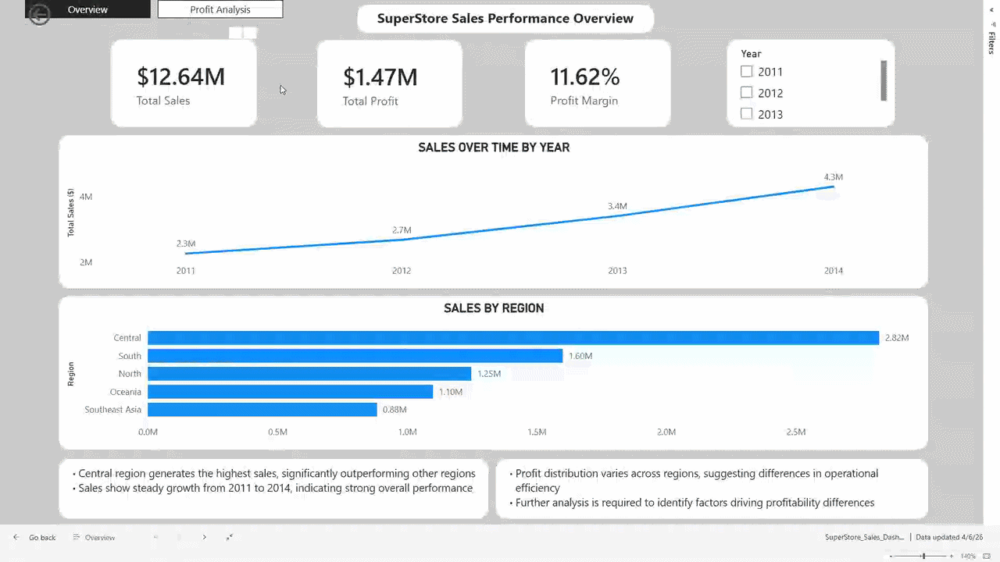
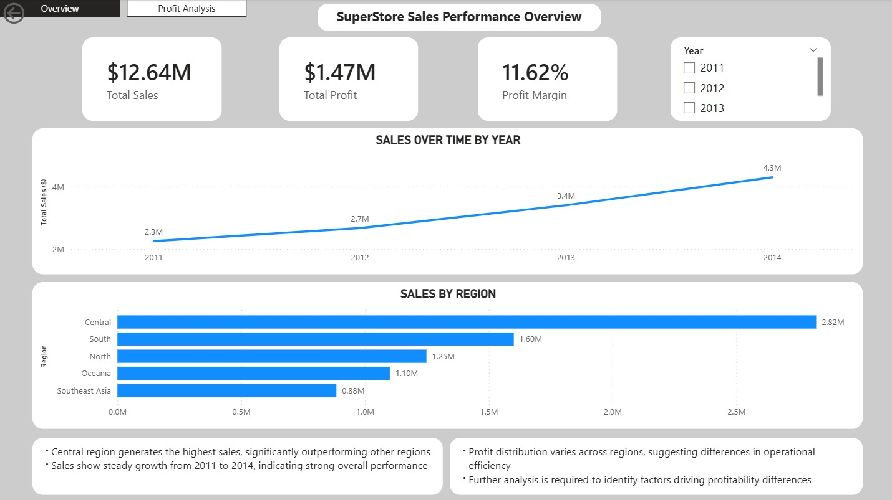
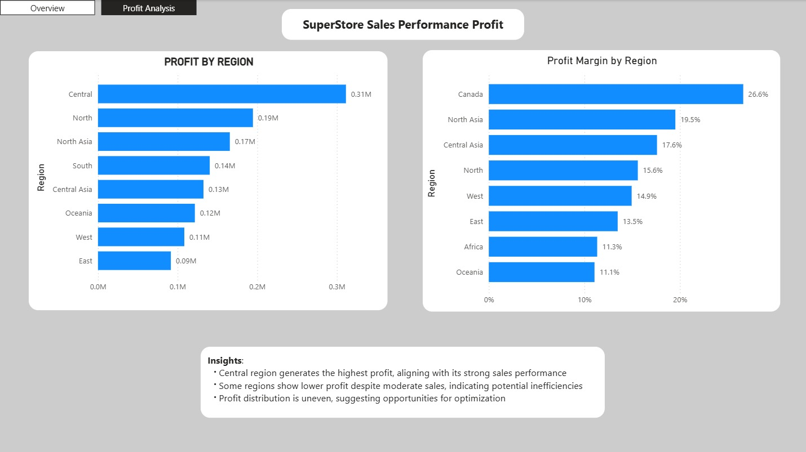

# SuperStore Sales & Profitability Analysis (Power BI)

## 📌 Project Overview
This project analyzes $12.6M in global sales data to identify key drivers of profitability and regional performance. 

## 📊 Dashboards
### Sales Overview

*Key Insight:* Steady growth from 2011-2014 with Central region leading in volume.

### Profit Analysis

*Key Insight:* Canada achieves the highest profit margin (26.6%), while Central focuses on high-volume, lower-margin sales.

## 🛠️ Technical Highlights
* **DAX Measures:** Developed custom measures for Profit Margin % using the `DIVIDE` function to ensure data accuracy at aggregate levels.
* **Data Modeling:** Cleaned and transformed raw CSV data using Power Query.
* **Interactive Features:** Implemented dynamic slicers and page navigation for an executive-user experience.

## 📂 How to use
1. Download the `SuperStore_Sales_Dashboard.pbix` file.
2. Open in Power BI Desktop to interact with the full dataset.
